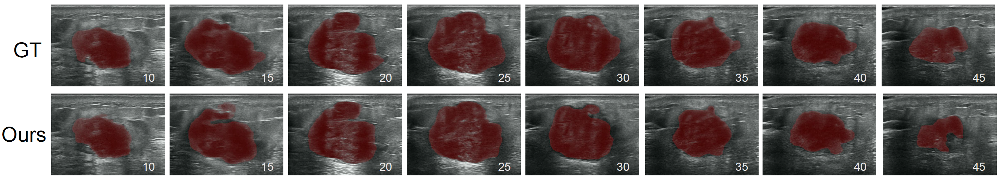

# CIOCR
# Code with an US breast lesion video from the testset upon our paper (Under Review).
# Note: Due to the ethical review and authorization processes within the relevant hospital and organization, this code and the US video data in this repository are concurrently only used to run our scripts (test.py), which means our repository are not be allowed for other purposes right now.
# Once our publication is accepted, we will share our code, our results, and the trained models of this work.

## Visual comparision results with SOTA methods

### ckpt download link:https://drive.google.com/file/d/1dKi_ynrmF0NpbkRQ_4X4LTu5pvUCcQhV/view?usp=sharing
